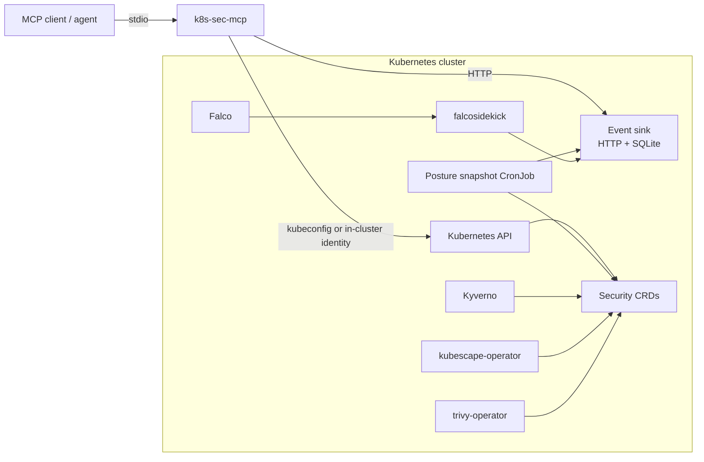

# Architecture

Last verified against repository: 2026-08-30 (`codex/phase1-event-sink-hardening`, pending maintainer review)

## System context

`k8s-sec-stack` collects evidence from four Kubernetes security projects and exposes a normalized, read-only MCP interface for agent-assisted analysis.

## Components

### Helm umbrella chart

`charts/k8s-sec-stack/` pins upstream chart versions and configures:

- Falco with modern eBPF and JSON HTTP output;
- falcosidekick forwarding Falco payloads to the event sink;
- trivy-operator CRD scanners for vulnerabilities, configuration, RBAC, infrastructure, secrets, and SBOMs;
- kubescape continuous scanning;
- Kyverno admission, background, cleanup, and report controllers;
- the project-owned event sink and posture-snapshot CronJob.

The default chart uses internal `ClusterIP` services. Optional NodePort exposure is isolated in `values-local-dev.yaml` and is intended only for disposable local labs.

### Event sink

The event sink is a project-owned Python application under `event-sink/` with a digest-pinned Python base image. It provides:

- `POST /events` for validated Falco payloads;
- `GET /events` for filtered normalized events (or redacted raw events when explicitly enabled);
- `GET /events/trends` for aggregate runtime trends;
- `POST /posture/snapshot` for daily metric batches;
- `GET /posture/trends` for historical posture metrics;
- `GET /healthz` for liveness and readiness.

All other routes and methods are rejected. Ingest and query routes use separate bearer tokens by default. Body size, snapshot batch size, filter length, time windows, result counts, response bytes, concurrent requests, and socket time are bounded. Event and posture schemas are validated before SQLite writes.

SQLite data is stored on a 1 GiB ReadWriteOnce PVC. Retention is chart-configurable from 1–365 days. Raw Falco bodies are discarded by default; operators may opt in and configure field redaction. The application remains a single process with an in-process database lock, so the RWO volume and SQLite design still constrain availability and scale.

### Posture snapshot CronJob

The CronJob reads selected CRDs with a cluster-scoped, read-only service account, computes counts/scores, and posts them to the event sink daily. It is already configured with a non-root container security context. Its upstream API parsing must be covered by fixtures because CRD shapes can change across operator versions.

### MCP server

`mcp-server/` is a Python stdio MCP server. Tool handlers use either:

- the Kubernetes Python client, loading in-cluster configuration first and local kubeconfig second; or
- authenticated HTTP requests to the event sink configured by `FALCO_SINK_URL` and `FALCO_SINK_TOKEN`.

Tools return JSON encoded as MCP text content. They are logically read-only, but their effective Kubernetes privilege is whatever the selected identity permits.

### Agent workflow skills

Files under `skills/` coordinate MCP tool calls. The principal correlation workflow is:

1. identify a Falco event;
2. verify whether the pod still exists;
3. resolve workload and image context;
4. join vulnerability, configuration, policy, network, and RBAC evidence;
5. currently calculate a bounded threat score and recommend a response.

That final step is a documented design debt. The target workflow returns observed facts, deterministic correlations, missing context, confidence, investigation steps, and possible containment options requiring human approval. It must not infer that an image CVE caused an observed process event.

The current correlation axis is a loose combination of namespace, pod/workload context, and image strings. Exact pod names are ephemeral, tags can move, and a direct owner can be only an intermediate ReplicaSet. The target correlation record includes pod UID, container ID, image digest, namespace, full owner chain, evidence timestamps/generation, source/scanner versions, and freshness.

## Trust boundaries

| Boundary | Data crossing it | Current control | Required direction |
|---|---|---|---|
| Falco/falcosidekick → event sink | runtime telemetry | ClusterIP, producer NetworkPolicy, ingest bearer token, schema/size limits | validate live connectivity under a policy-enforcing CNI; use TLS or mTLS if traffic crosses an untrusted network |
| Snapshot CronJob → event sink | aggregate security posture | ClusterIP, producer NetworkPolicy, ingest bearer token, route/schema/batch limits | validate live connectivity under a policy-enforcing CNI |
| MCP server → Kubernetes API | cluster inventory and security findings | caller kubeconfig or pod identity | documented least-privilege read-only role |
| MCP server → event sink | normalized/aggregate runtime evidence | query bearer token plus port-forward or explicitly labeled in-cluster pod | add TLS or a reviewed proxy for remote access; do not expose the plain HTTP service directly |
| MCP server → agent/model | potentially sensitive cluster evidence | stdio session | minimization, redaction, limits, and operator awareness |
| Repository → published articles | commands, screenshots, findings | manual scrubbing | claim matrix and explicit sanitization gate |

## Provider-neutral target

Provider neutrality applies in three dimensions:

- **MCP client:** core installation should describe a generic stdio server declaration; Claude, Codex, and other clients become separate examples.
- **Kubernetes environment:** service discovery must derive from the Helm release namespace, and local-cluster conveniences must not be required by the core chart.
- **LLM workflow:** tool schemas and JSON results are the contract; reusable skills should avoid assumptions about one vendor's proprietary commands.

The target MCP design should separate:

1. transport and server registration;
2. Kubernetes/security data adapters;
3. stable domain models and schemas;
4. workflow prompts/evaluations.

Provider-neutral workflows should live separately from client packaging. A likely target layout is `workflows/` for investigation procedures plus `clients/<host>/` for Codex, Claude Code, VS Code, or other host-specific registration and commands. Reusable MCP prompts can be evaluated later without making them a prerequisite for core tool interoperability.

This makes parser and transport changes testable without changing every skill.

## Key extension points

- Add new evidence sources behind adapters that return stable internal models.
- Add a correlation layer that uses workload UID, owner reference, labels, and image digest.
- Add pagination/response budgets without changing semantic tool names.
- Return declared structured content and schemas while keeping a compatibility text representation during migration.
- Support an in-cluster MCP deployment or secure API gateway while retaining stdio for local use.
- Export normalized evidence to external systems without coupling core collection to one SIEM or agent.

## Known architecture constraints

- the packaged event-sink image has not yet been published, so the chart retains a tag fallback until a release digest exists;
- bearer tokens protect route classes but plain in-cluster HTTP does not provide transport confidentiality;
- NetworkPolicy behavior depends on a policy-enforcing CNI and still needs live connectivity verification;
- one replica and one RWO SQLite volume limit availability and scale;
- raw CRD dictionaries flow directly into tool-specific parsers with no versioned domain model;
- MCP results remain JSON-in-text without pagination, although the event-sink HTTP API now enforces result and response-size limits;
- untrusted Kubernetes fields and Falco output cross into model context without a documented injection-resistance contract;
- client-specific skills are currently presented adjacent to the MCP layer, obscuring the host/client/model boundary.
